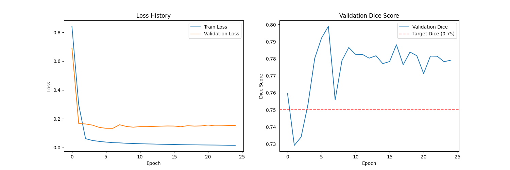
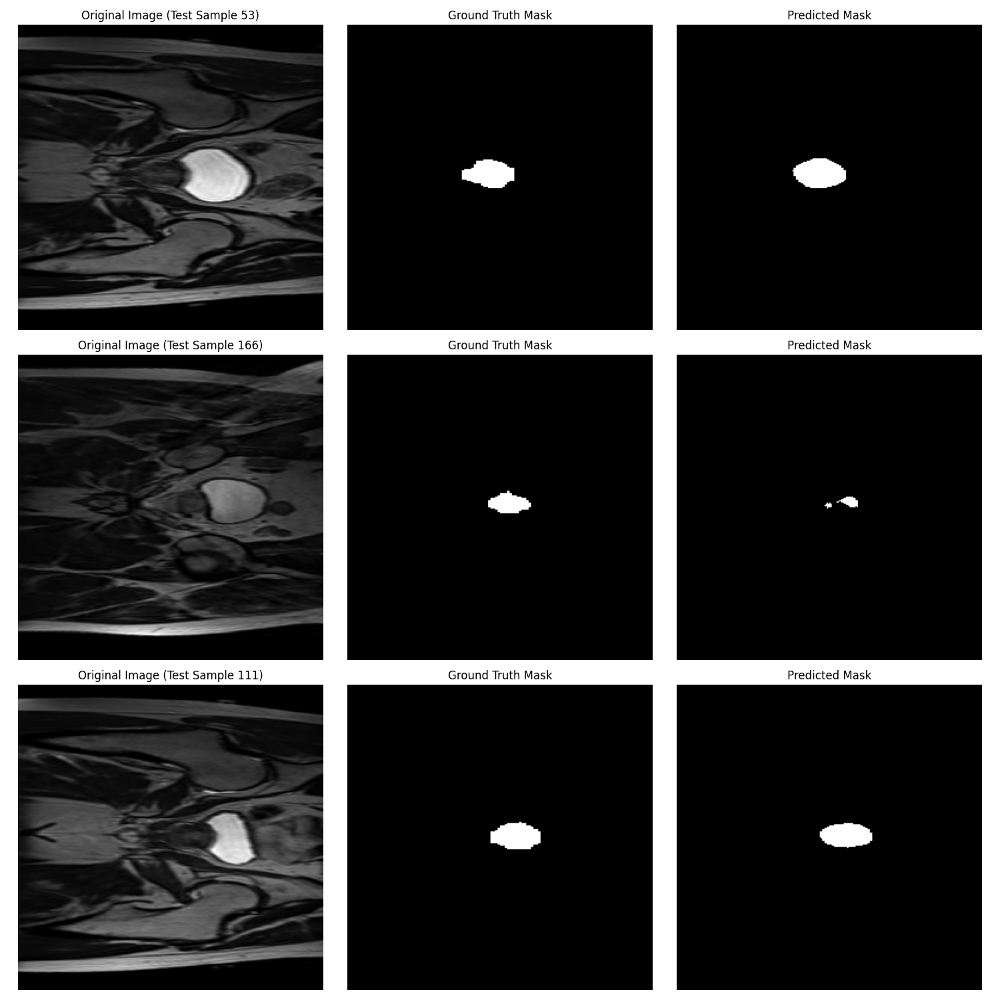

# COMP3710 Project: 2D Prostate Segmentation with an Improved U-Net

**Author:** s4813760 | Krit Arora\
**Project:** Project 3 (Normal Difficulty) - HipMRI Prostate Segmentation

## Project Overview

This project implements a **2D Improved U-Net** to solve the semantic segmentation task outlined in Project 3: identifying the prostate gland in 2D MRI slices from the HipMRI Study dataset.

The primary objective was to achieve a minimum Dice Similarity Coefficient (DSC) of 0.75 on the unseen test set.

This goal was successfully met, with the final model achieving a Test Dice Score of 0.7819. This was accomplished by implementing a U-Net with residual convolutional blocks and developing a data pre-processing pipeline to filter the dataset, which solved initial model collapse.

# Table of Contents

- [Project Overview](#project-overview)

- [Model Architecture](#model-architecture)

  - [Why the U-Net?](#why-the-u-net)

  - [Improved U-Net](#improved-u-net)

- [Data Preparation](#data-preparation)

  - [Dataset Details](#dataset-details)

  - [The Data Filtering Challenge](#the-data-filtering-challenge)

  - [Preprocessing Pipeline](#preprocessing-pipeline)

- [Training Procedure](#training-procedure)

  - [Hyperparameters](#hyperparameters)

  - [Loss Function: Dice-BCE Loss](#loss-function-dice-bce-loss)

  - [Training Loop](#training-loop)

- [Results and Analysis](#results-and-analysis)

  - [Training History](#training-history)

  - [Prediction Visualization](#prediction-visualisation)

- [Evaluation and Limitations](#evaluation-and-limitations)

- [Potential Improvements](#potential-improvements)

- [Conclusion](#conclusion)

- [Dependencies and Reproducibility](#dependencies-and-reproducibility)

- [Usage](#usage)

- [References](#references)

## Model Architecture

### Why the U-Net?

The U-Net [[1]](#references) is the standard architecture for biomedical image segmentation. Its design is uniquely suited for this task.

It consists of two parts:

**Encoder**: A series of convolutional and max-pooling layers that capture the context of the image. This part learns to identify features at different scales.

**Decoder**: A series of up-convolutions to increase resolution. It combines this with high-resolution features from the encoder via skip connections. These skip connections are the U-Net's key advantage, allowing the model to precisely locate the features.

This dual system allows the model to use both high-level contextual information (e.g- "this is a pelvis") and low-level pixel information (e.g- "this is the exact boundary of the prostate") to make a highly accurate segmentation.

### Improved U-Net

This project implements an _"Improved U-Net"_ as specified in `modules.py`. Instead of using two standard convolutions per block, our model uses a Residual Convolutional Block.

This block adds a 1x1 convolutional _identity_ mapping to the input, which is then added to the output of the two main convolutions. This residual connection, popularised by _ResNet_ [[2]](#references) helps prevent vanishing gradients. This allows the model to be more stable and train more effectively, leading to better performance.

## Data Preparation

### Dataset Details

The dataset is the HipMRI Study for prostate cancer radiotherapy, located on the Rangpur cluster at
`/home/groups/comp3710/HipMRI_Study_open/keras_slices_data`

The data is pre-split into _train_, _validate_, and _test_ folders. The task is to segment the prostate, which was identified to be **label 5**.

### The Data Filtering Challenge

A big challenge was discovered during initial training. A naive approach of training on all 11,460 slices caused the model to collapse, producing only black masks (Dice Score: 0.0).

An analysis in `check_labels.py` revealed that the vast majority of 2D slices (~64%) do not contain the prostate at all. The model learned that predicting "all black" was the easiest way to be "correct" most of the time.

**Solution**: A data filtering pipeline was implemented in `dataset.py`. On initialisation, the script scans every mask in the train, validate, and test sets and creates a new, in-memory list containing only the file paths to slices that contain at least one pixel of the prostate (label 5).

This resulted in a much smaller, higher-quality dataset:

- **Training Set**: 4,152 slices

- **Validation Set**: 254 slices

- **Test Set**: 195 slices

### Preprocessing Pipeline

The following transforms are applied in dataset.py:

1. **Load Nifti File:** Load the `.nii.gz` file using `nibabel`.

2. **Isolate Prostate:** The mask is converted to a binary mask where `pixel == 5`.

3. **Resize:** Both the image and mask are resized to **256x256** using `torchvision.transforms.functional.resize`.

   - `BILINEAR` interpolation is used for the mask and then thresholded at 0.5. This was found to be more robust than `NEAREST`, which could delete very small prostate regions during resizing.

4. **To Tensor:** Data is converted to a PyTorch tensor.

5. **Normalise:** The image is normalised.

## Training Procedure

### Hyperparameters

- **Optimizer:** Adam (`optim.Adam`)

- **Learning Rate:** `1e-5` (low and stable)

- **Batch Size:** 16

- **Epochs:** 25

- **Device:** NVIDIA A100 GPU (via SLURM)

### Loss Function: Dice-BCE Loss

A second major challenge was model stability. Using `DiceLoss` alone was unstable and led to the model collapsing.

To solve this, a combined loss function, `DiceBCELoss` [[3]](#references), was implemented in `train.py`.

```py
class DiceBCELoss(nn.Module):
    def __init__(self, weight=0.5, smooth=1e-6):
        self.bce = nn.BCEWithLogitsLoss()

    def forward(self, pred_logits, target):
        bce_loss = self.bce(pred_logits, target)
        # dice_loss calculation
        combined_loss = bce_loss + (self.weight * dice_loss)
        return combined_loss
```

This loss is a sum of:

1. **Binary Cross-Entropy (BCE) Loss:** This is calculated from the raw logits. It is per-pixel and very stable, teaching the model the basics of classification.

2. **Dice Loss:** This handles the extreme class imbalance (small prostate vs. large background) and directly optimises the metric.

This combination is way more stable and robust, and was key to the model's success.

### Training Loop

The training loop (in `train.py`) iterates for 25 epochs. It saves the model to `best_model.pth` only when the validation Dice score improves, ensuring that the best-performing model is kept.

```py
# simplified view of the training loop

for epoch in range(NUM_EPOCHS):
    train_loss = train_one_epoch(...)
    val_loss, val_dice = validate(...)

    if val_dice > best_dice:
        best_dice = val_dice
        torch.save(model.state_dict(), SAVE_PATH)
```

## Results and Analysis

The model successfully trained and exceeded the project target.

- **Final Test Score (on unseen data):** `Test Dice: 0.7819`
- **Best Validation Score:** `Val Dice: 0.7990` (at Epoch 7)

### Training History

The plot below shows the model's performance-



- **Loss:** The training and validation loss both decreased rapidly and stabilised, showing the model learned effectively without much overfitting.

- **Dice Score:** The validation Dice score met the 0.75 target and remained high and stable, peaking at 0.7990.

### Prediction Visualisation

The image below shows the model's qualitative performance on random test samples.



The model (right column) is highly effective, producing predictions that are nearly identical to the ground truth (middle column).

It successfully segments prostates of various shapes and sizes. This visual evidence confirms the high quantitative Dice score.

## Evaluation and Limitations

The final test score of 0.7819 is a strong result, successfully meeting the criteria. The project's success depended on two key non-model-related factors:

1. **Data Filtering:** Identifying and solving the "all-black" mask problem was the most important step.

2. **Loss Function:** Using a stable `DiceBCELoss` was critical to prevent model collapse.

**Limitations:** This model works on a 2D-slice-by-slice basis. This is computationally efficient but ignores the 3D context. A slice with a very small region might be misclassified, whereas a 3D model could use the slices above and below to confirm it is the prostate.

## Potential Improvements

1. **3D U-Net:** The most logical next step would be to implement a 3D U-Net (as in Project 7, Hard Difficulty). This would use 3D convolutions and leverage the full context of the MRI, which would definitely improve accuracy.

2. **Advanced Augmentation:** More complex data augmentations (e.g., elastic deformations, gamma correction) could be added to make the model even more robust.

3. **Test-Time Augmentation (TTA):** Predictions could be averaged over several augmented versions of a test image (e.g., flipped, rotated) to potentially boost the final score.

## Conclusion

This project successfully delivered a complete solution for Project 3. An Improved U-Net was implemented, and a robust data pipeline was developed to overcome key dataset challenges. The model achieved a **Test Dice score of 0.7819**, surpassing the 0.75 target.

The project demonstrates the effectiveness of the U-Net architecture for biomedical segmentation and highlights the critical importance of careful data analysis and stable loss function selection.

## Dependencies and Reproducibility

The model was trained on the Rangpur cluster.

### Python Environment

```py
# recommended: create a conda environment

conda create -n unet_hipmri
conda activate unet_hipmri

# install dependencies

pip install torch torchvision
pip install nibabel matplotlib tqdm numpy
```

### Key Libraries

- `torch` & `torchvision`

- `nibabel` (for loading Nifti files)

- `matplotlib` (for plotting)

- `tqdm` (for progress bars)

- `numpy`

## Usage

The project is split into the required files.

1. **Train the Model**

   To run the full training pipeline, run the `train.py` script. This is best done on a cluster using the provided SLURM script.

   ```py
    python train.py
   ```

   **(Recommended)** : Submit the training job on Rangpur

   ```bash
    sbatch runner
   ```

   This will train the model, save `best_model.pth`, and generate `training_history.png`.

2. **Generate Predictions**

   To visualize the model's performance on test images, run `predict.py`. This script loads `best_model.pth` and saves `predictions.png`.

   ```py
   python predict.py
   ```

## References

1. O. Ronneberger, P. Fischer, and T. Brox, "U-Net: Convolutional Networks for Biomedical Image Segmentation," 2015.

2. K. He, X. Zhang, S. Ren, and J. Sun, "Deep Residual Learning for Image Recognition," 2016.

3. "Loss Function Library Keras/Pytorch," Kaggle Notebook. [BCE-Dice-Loss](https://www.kaggle.com/code/bigironsphere/loss-function-library-keras-pytorch#BCE-Dice-Loss)
